# Project Report
## Course - CS 583 (Data Mining and Text Mining)
## Term - Fall 2020

## Team - 
- Keshvi Srivastava     652825616
- Sneha Mysore Suresh   677216079

### 1. Introduction

Social media platforms, such as Facebook and Twitter, have not only changed the way we interact with one another but also the way we share news and comment on world events.Twitter has become an increasingly relevant tool in domestic and international politics. The platform has become a way to promote policies and interact with citizens and other officials.Sentiment analysis of Twitter data is becoming a popular research area. 

In this project we built models for classifying tweets about Obama and Romney during the presidential debate from 2012 into positive, negative and neutral sentiments. We have studied various approaches to work with tweet analysis which are explained below. Our study excludes class '2' tweets which come under the category of sarcasm detection.

### 2. Dataset and pre-processing

Obama - 
  Total              -> 7196 tweets
  Removing Class 2   -> 5624 tweets
  
Romney -
  Total               -> 7200 tweets
  Removing Class 2    -> 5648 tweets
  
Tweet Pre-processing -
 
Cleaning the data to remove irrelevant words and character is a big part of text classification. We studied our data to identify what problems exist within it. We applied standard tweet pre-processor cleaning libraries but those were not enough. To compensate for the remaining dirty data, we have done additional cleaning. All the cleaning processes are given below:

1. Tweet pre-processing class (tweet-preprocessor)
    Removes:  
      a. URLs
      b. Hashtags
      c. Mentions
      d. Reserved words (@RT, FAV)
      e. Emojis 
      f. Smileys
      g. JSON and .txt file support
2. Remove explicit character specified smileys
3. Remove html tags
4. Remove punctuations
5. Remove white space
6. Split negative words such as 'don't' to 'do not'. This turns the data into a uniform format which does not have a mixture of shortened words and their split words. It also highlights the negative words such as 'not'.
7. Remove unicodes
8. Remove stop words -> Apart from the standard nltk library stop words, we also added 'RT' as a stop word to the list (it stands for retweet and was not removed by the tweet pre-processor because it did not follow '@' in the tweets)
9. Lemmatization

### 3. Data Visualisation

On visualising the data, we observed that for both Obama and Romney the two respective names occur the most in their respective tweets, whether positive, negative or neutral. Also, a lot of words tend to overlap in the different classes of tweets which made it very difficult to use 'bag of words' for our classification models. 

**I. Word clouds**
**OBAMA**

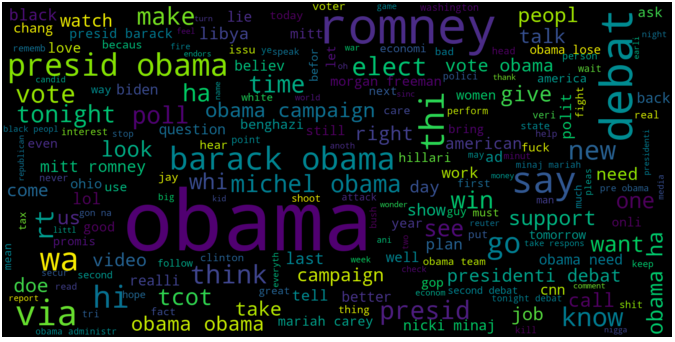 Obama Negative Word Cloud
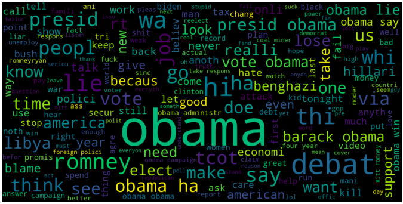 Obama Neutral Word Cloud
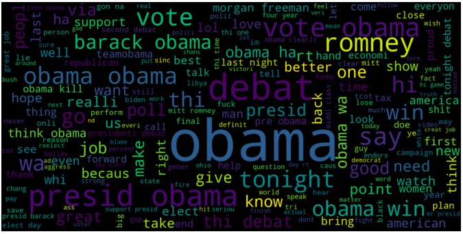 Obama Positive Word Cloud

**ROMNEY**

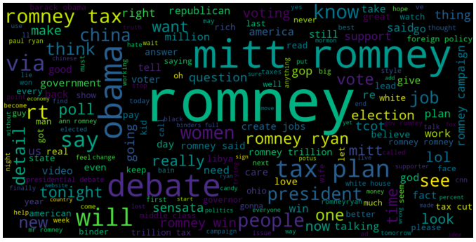 Romney Negative Word Cloud
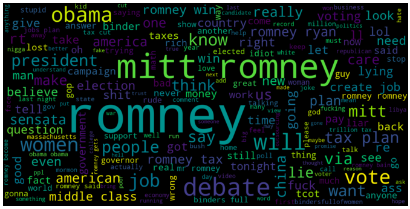 Romney Neutral Word Cloud
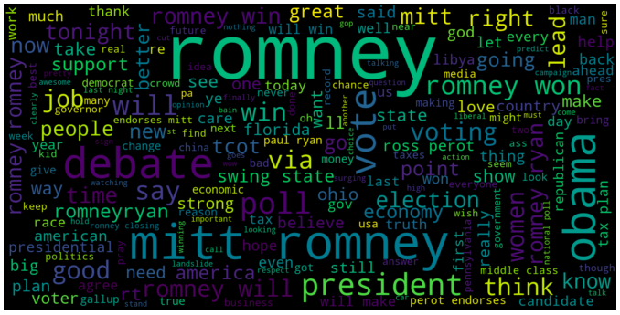 Romney Positive Word Cloud

**II. Top 50 negative, neutral and positive words**

**OBAMA**

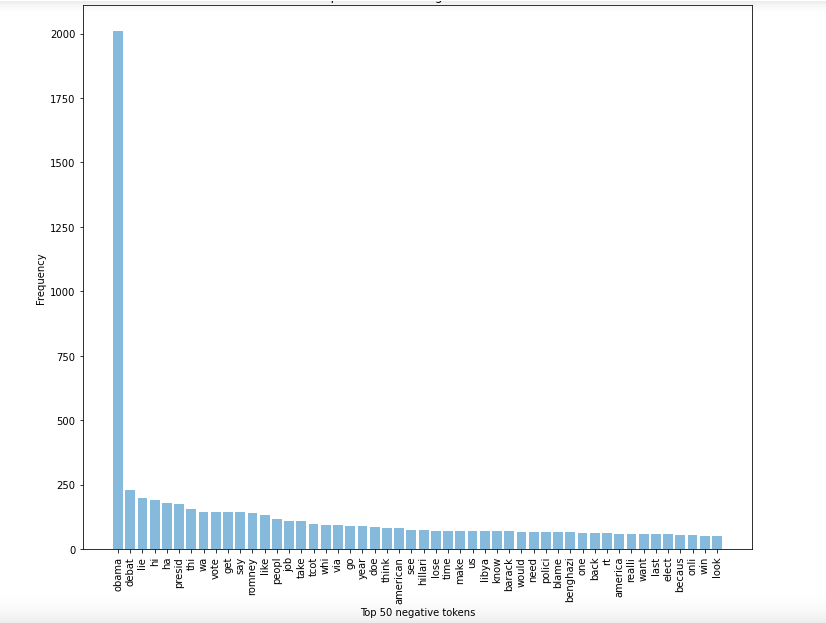 Obama Negative Word Count
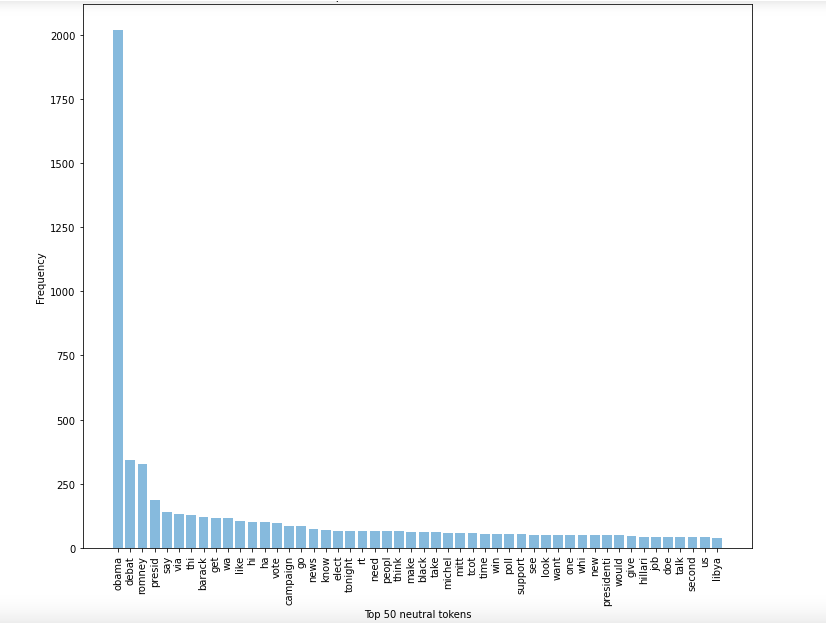 Obama Neutral Word Count
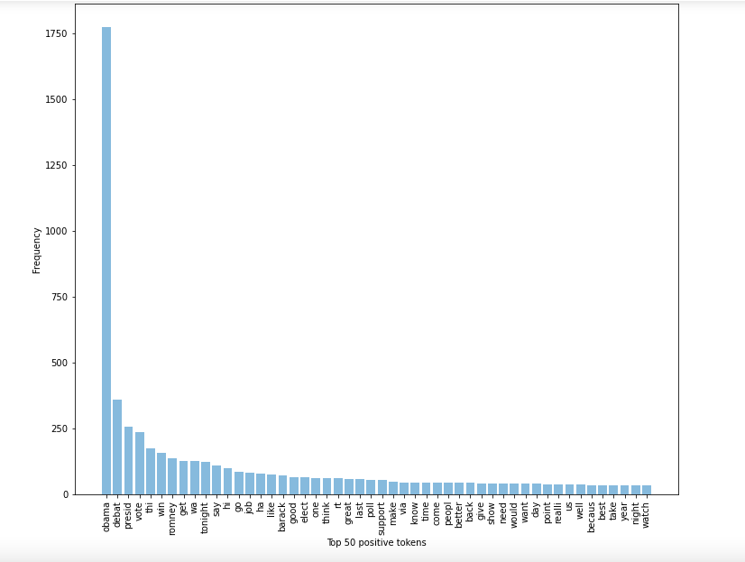 Obama Positive Word Count

**ROMNEY**

 Romney Negative Word Count
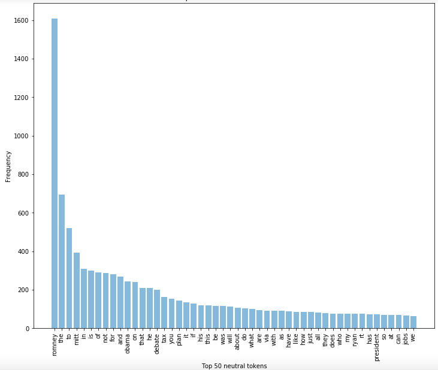 Romney Neutral Word Count
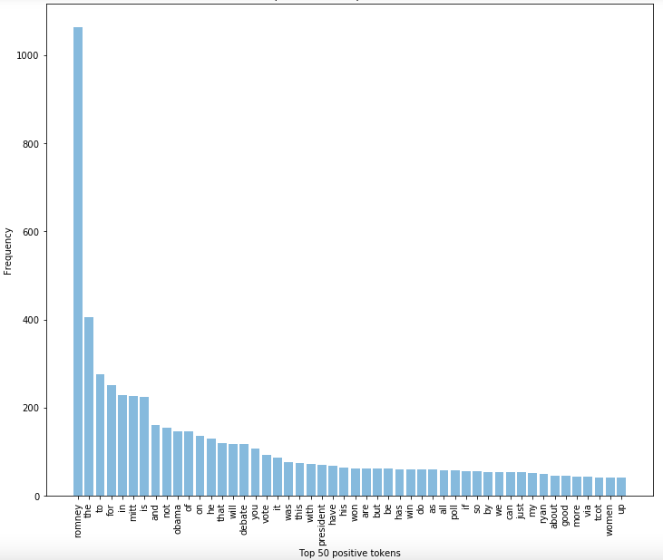 Romney Positive Word Count

### 4. Models tried

1. TextBlob - TextBlob is a python library and offers a simple API to access its methods and perform basic NLP tasks. A good thing about TextBlob is that they are just like python strings. So, you can transform and play with it same like we did in python
2. Logistic Regression
3. Linear SVC
4. LinearSVC with L1-based feature selection
5. Multinomial NB
6. Bernoulli NB
7. Ridge Classifier
8. AdaBoost
9. Perceptron
10. Nearest Centroid
11. Ensemble : LogisticRegression, LinearSVC, MultinomialNB, RidgeClassifier, PassiveAggressiveClassifier
12. Doc2Vec : <Add some info>

Tfid Vectorizer : TF-IDF Vectorizer converts documents to a matrix of TF-IDF (term frequency - inverse document frequency) features. We fed the following parameters to the tfid vectorizer - (n_features=100000,ngram_range=(1,3),stop_words=None). This matrix is fed to the above models for sentiment prediction.

**OBAMA**

Training set:   5342

Test set:       282

|                 Models                     |    Accuracy   |  
|--------------------------------------------|:-------------:|
| TextBlob                                   |      43%      |
| Logistic Regression                        |     63.12%    |
| Linear SVC                                 |     63.48%    |
| LinearSVC with L1-based feature selection  |     59.93%    |
| Multinomial NB                             |     64.18%    |
| Bernoulli NB                               |     58.51%    |
| **Ridge Classifier**                       |   **64.54%**  |
| AdaBoost                                   |     44.33%    |
| Perceptron                                 |     60.64%    |
| Nearest Centroid                           |     59.93%    |
| Ensemble                                   |     60.78%    |
| Doc2Vec                                    |               |

From the above table we can see that Ridge Classifier has the highest accuracy for the obama model.

**ROMNEY**

Training set:   5083

Test set:       565

|                 Models                     |    Accuracy   |  
|--------------------------------------------|:-------------:|
| TextBlob                                   |      43%      |
| Logistic Regression                        |     58.30%    |
| Linear SVC                                 |     62.54%    |
| **LinearSVC with L1-based feature selection**  |     **63.25%**    |
| Multinomial NB                             |     47.35%    |
| Bernoulli NB                               |     44.52%    |
| Ridge Classifier                           |     60.78%    |
| AdaBoost                                   |     50.88%    |
| Perceptron                                 |     62.19%    |
| Nearest Centroid                           |     60.07%    |
| Ensemble                                   |     60.78%    |
| Doc2Vec                                    |               |

From the above table we can see that LinearSVC with L1-based feature selection has the highest accuracy for the obama model.

### 5. Results

We played around with the above models and different ways of data pre-processing. Interestingly, these were our results:

|                     |               Obama                          |                      Romney                  | 
|---------------------|:--------------------------------------------:|:--------------------------------------------:|
|  Pre-processing     |    stop words and lemmatization included     |  stop words and lemmatization not included   |
|      Model          |            Ridge Classifier                  | Linear SVC with feature selection            |
|    **Precision**        |
|     Class 1         |                 0.64                         |                        0.61                  |
|     Class -1        |                 0.69                         |                        0.65                  |
|    **Recall**           |                                              |                                              |
|     Class 1         |                 0.75                         |                        0.59                  |
|     Class -1        |                 0.75                         |                        0.81                  |
|    **F1 Score**         |                                              |                                              |
|     Class 1         |                 0.58                         |                        0.60                  |
|     Class -1        |                 0.61                         |                        0.72                  |
|  **Weighted Accuracy**  |                 0.67                         |                        0.63                  |

Interestingly the accuracy of the Romney model improved by not removing the stop words or doing lemmatization on the tweets.

### 6. Conclusion
 
Issues with neural network
Data processing problems
Special characters
Emojis
Identifying special words (eg. RT)

