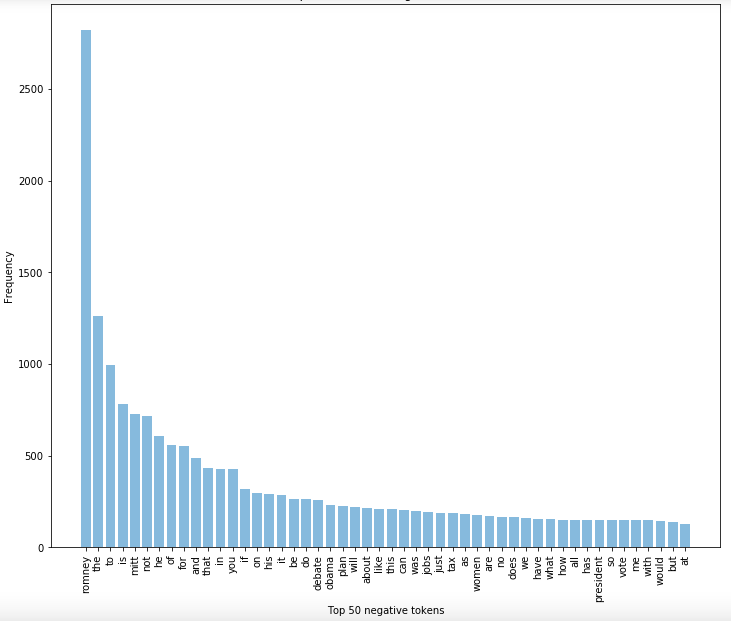

# Project Report
## Course - CS 583 (Data Mining and Text Mining)
## Term - Fall 2020

## Team - 
- Keshvi Srivastava     652825616
- Sneha Mysore Suresh   677216079

### 1. Introduction

Social media platforms, such as Facebook and Twitter, have not only changed the way we interact with one another but also the way we share news and comment on world events.Twitter has become an increasingly relevant tool in domestic and international politics. The platform has become a way to promote policies and interact with citizens and other officials.Sentiment analysis of Twitter data is becoming a popular research area. 

In this project we built models for classifying tweets about Obama and Romney during the presidential debate from 2012 into positive, negative and neutral sentiments.

### 2. Dataset and pre-processing

Obama - 
  Total              -> 7196 tweets
  Removing Class 2   -> 5624 tweets
  
Romney -
  Total               -> 7200 tweets
  Removing Class 2    -> 5648 tweets
  
Tweet Pre-processing -
 
 1. Remove stop words -> added 'RT' as a stop word to the list as it was not relevant (it stands for retweet)
 2. Lemmatization
 3. Tweet pre-processing class (tweet-preprocessor)
    Removes:  
      a. URLs
      b. Hashtags
      c. Mentions
      d. Reserved words (@RT, FAV)
      e. Emojis 
      f. Smileys
      g. JSON and .txt file support
4. Remove unicode smileys
5. remove html tags
6. remove punctuations
7. Remove white space
8. Split negative words
9. Remove unicodes

### 3. Data Visualisation

**I. Word clouds**
**OBAMA**

 Obama Negative Word Cloud
 Obama Neutral Word Cloud
 Obama Positive Word Cloud

**ROMNEY**

 Romney Negative Word Cloud
 Romney Neutral Word Cloud
 Romney Positive Word Cloud

**II. Top 50 negative, neutral and positive words**

**OBAMA**

 Obama Negative Word Count
 Obama Neutral Word Count
 Obama Positive Word Count

**ROMNEY**

 Romney Negative Word Count
 Romney Neutral Word Count
 Romney Positive Word Count

### 4. Models tried

1. TextBlob - TextBlob is a python library and offers a simple API to access its methods and perform basic NLP tasks. A good thing about TextBlob is that they are just like python strings. So, you can transform and play with it same like we did in python
2. Logistic Regression
3. Linear SVC
4. LinearSVC with L1-based feature selection
5. Multinomial NB
6. Bernoulli NB
7. Ridge Classifier
8. AdaBoost
9. Perceptron
10. Nearest Centroid
11. Ensemble : LogisticRegression, LinearSVC, MultinomialNB, RidgeClassifier, PassiveAggressiveClassifier
12. Doc2Vec

Tfid Vectorizer : 

**OBAMA**

|                 Models                     |    Accuracy   |  
|--------------------------------------------|:-------------:|
| TextBlob                                   |      43%      |
| Logistic Regression                        |     63.12%    |
| Linear SVC                                 |     63.48%    |
| LinearSVC with L1-based feature selection  |     59.93%    |
| Multinomial NB                             |     64.18%    |
| Bernoulli NB                               |     58.51%    |
| **Ridge Classifier**                       |   **64.54%**  |
| AdaBoost                                   |     44.33%    |
| Perceptron                                 |     60.64%    |
| Nearest Centroid                           |     59.93%    |
| Ensemble                                   |     60.78%    |
| Doc2Vec                                    |               |

From the above table we can see that Ridge Classifier has the highest accuracy for the obama model.

**ROMNEY**

|                 Models                     |    Accuracy   |  
|--------------------------------------------|:-------------:|
| TextBlob                                   |      43%      |
| Logistic Regression                        |     58.30%    |
| Linear SVC                                 |     62.54%    |
| **LinearSVC with L1-based feature selection**  |     **63.25%**    |
| Multinomial NB                             |     47.35%    |
| Bernoulli NB                               |     44.52%    |
| Ridge Classifier                           |     60.78%    |
| AdaBoost                                   |     50.88%    |
| Perceptron                                 |     62.19%    |
| Nearest Centroid                           |     60.07%    |
| Ensemble                                   |     60.78%    |
| Doc2Vec                                    |               |

From the above table we can see that LinearSVC with L1-based feature selection has the highest accuracy for the obama model.

### 5. Results

Obama   - stop words and lemmatization included

        - model selected  -> Ridge Classifier
      
Romney  - stop words and lemmatization not included

        - model selected  -> Linear SVC with feature selection

### 6. Conclusion
 
  
